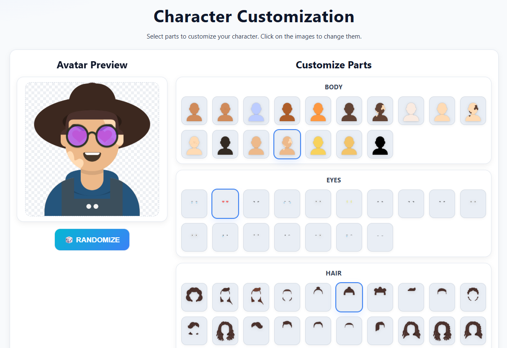

# Character Customizer 🎨 (React)

[](https://<your-username>.github.io/character-customizer)


A simple **character/avatar customizer** built with **React + CSS**. Pick body, hair, eyes, eyebrows, mouth, clothing layers, glasses and hats — or hit **Randomize** for a surprise look!

---

## Highlights

- ⚡️ Instant preview with layered PNGs
- 🎲 **Randomize**: generate a full avatar config in one click
- 🧩 Modular parts list with smart folder mapping
- 💅 Polished UI: checkerboard canvas, hover-zoom tiles, sticky preview
- ♿️ Keyboard/focus styles for accessible browsing

---

## Screenshot

> Add your screenshot at `public/screenshot.png`, then reference it here:



---

## Tech & Concepts

- **React function components** (`Avatar`, `PartList`, `App`)
- **State management** with `useState` and **immutable updates**
- **Derived UI** from a `parts` descriptor (title + total variants)
- **Randomizer** built with `useCallback`
- **Responsive, modern CSS** (custom properties, grid, hover zoom, sticky)

---

## Project structure

```
/ # project root
├── src/
│   ├── components/
│   │   ├── Avatar.js         # Layer images (body, hair, eyes, etc.) into a canvas
│   │   └── PartList.js       # Render selectable tiles for a given part
│   ├── App.js                # State, randomize, layout, and wiring
│   ├── App.css               # Global styles, grid, tiles, hover effects
│   ├── index.js              # React entry
│   └── total.js              # (Optional) totals of assets per part
├── public/
│   ├── images/               # assets: body, hair, eyes, clothing, accessories...
│   └── index.html
├── package.json
└── README.md
```

---

## Run locally

1. **Clone & install**

   ```bash
   git clone https://github.com/kiettt23/character-customizer.git
   cd character-customizer
   npm install
   ```

2. **Start dev server**
   ```bash
   npm start
   ```
   App runs at **http://localhost:3000** by default.

---

## How it works (quick tour)

- **State shape**

  ```js
  const [avatar, setAvatar] = useState({
    body: 1,
    eyes: 1,
    hair: 1,
    mouths: 1,
    eyebrows: 1,
    clothing1: 1,
    clothing2: 1,
    clothing3: 1,
    glasses: 1,
    hats: 1,
  });
  ```

- **Update a single part**

  ```js
  const onChange = (key, value) => setAvatar((s) => ({ ...s, [key]: value }));
  ```

- **Randomize all parts once**

  ```js
  const randomize = useCallback(() => {
    const next = {};
    Object.entries(parts).forEach(([key, value]) => {
      next[key] = Math.floor(Math.random() * value.total) + 1;
    });
    setAvatar(next);
  }, []);
  ```

- **Layering images**
  `Avatar` stacks PNGs (z-indexed) into a 320×320 canvas so each selected part renders on top of the previous ones.

---

## Folder mapping cheat‑sheet

Assets live under `/public/images`. Some parts use nested folders:

| Part key    | Folder path                  |
| ----------- | ---------------------------- |
| `body`      | `images/body`                |
| `eyes`      | `images/eyes`                |
| `hair`      | `images/hair`                |
| `mouths`    | `images/mouths`              |
| `eyebrows`  | `images/eyebrows`            |
| `clothing1` | `images/clothes/layer_1`     |
| `clothing2` | `images/clothes/layer_2`     |
| `clothing3` | `images/clothes/layer_3`     |
| `glasses`   | `images/accessories/glasses` |
| `hats`      | `images/accessories/hats`    |

> Tip: Keep file names numeric (`1.png`, `2.png`, …) to align with the component logic.

---

## Scripts

```bash
npm start     # start dev server
npm run build # production build
```

---

## Deploy

- **Netlify**: drag‑and‑drop the `build/` folder or connect the repo.
- **GitHub Pages**: build and publish `/build` with your preferred workflow.
- **Vercel**: import repo, framework = Create React App (or override).

Update the **Live** badge URL at the top once deployed.

---

## Roadmap

- [ ] Export avatar as **PNG** (merge layers to one image)
- [ ] **Download config** (JSON) & **Load config**
- [ ] Persist last selection in **localStorage**
- [ ] Theme switch (dark/light)
- [ ] Add keyboard navigation for tiles
- [ ] ARIA labels for parts and preview
- [ ] Unit tests for folder mapping and randomizer

---

## Accessibility & UX

- Focus styles for interactive tiles
- Large hit‑areas on tiles and buttons
- Clear section headings and reading order
- Consider adding `aria-live` to announce changes in preview

---

## Performance notes

- Keep images optimized (use lossless compression on PNGs)
- Consider lazy‑loading grid tiles if the asset count grows
- Memoize expensive computations if needed

---

## License

MIT — feel free to use and adapt. See `LICENSE` if available.
